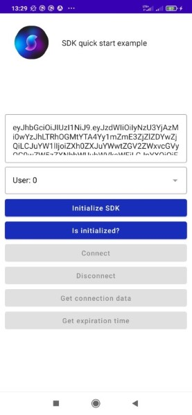

# SyncStage Android Quick Start Example
[SyncStage webpage: https://sync-stage.com/](https://sync-stage.com/)
## Prerequisites

Before starting this guide make sure you have these prerequisites in place.

1. You have received a SyncStage access token by filling in the Early Access Request form [HERE](https://sync-stage.com/).

2. We assume that you’re using [Android Studio](https://developer.android.com/studio). To test your Android device over wifi (as opposed to USB) you’ll need at least the “Bumble Bee” version of Android Studio. This is especially useful when you do not have a mini jack port in your smartphone and would like to use USB C headphones while debugging.

3. We host core SyncStage packages on Github. You’ll need a Github account, and will need to generate a personal access token that has the ‘read:packages’ scope enabled. For help creating a GitHub Personal Access Token please refer to [this guide](https://docs.github.com/en/enterprise-server@3.4/authentication/keeping-your-account-and-data-secure/creating-a-personal-access-token).

4. You’ll need to enable developer mode on your Android device so you can stream debug information back to Android Studio while testing. This is a useful guide for [enabling developer mode](https://www.samsung.com/uk/support/mobile-devices/how-do-i-turn-on-the-developer-options-menu-on-my-samsung-galaxy-device/#:~:text=1%20Go%20to%20%22Settings%22%2C,enable%20the%20Developer%20options%20menu.).

## Getting Started

First you’ll need to clone the SyncStage Android Example:

```
git clone https://github.com/opensesamemedia/syncstage-android/
cd syncstage-android
```

To run the example app, you’ll first need to make sure you can download the core SyncStage packages from GitHub. This requires that you add your GitHub username and personal access token (the one with ‘read:packages’ scope enabled) to ./build.gradle like this:

```
allprojects {
    repositories {
        google()
        mavenCentral()
        maven {
            name = "GitHubPackages"
            url "https://maven.pkg.github.com/opensesamemedia/syncstagesdkpackage"
            credentials {
                username = “YOUR GITHUB USERNAME”
                password = “YOUR GITHUB PERSONAL ACCESS TOKEN”
            }
        }
    }
}
```

Make sure your Android device is connected to Android Studio and then you hit ‘Run’. This will build the example application and then install it on your Android device.

### Permissions

SyncStage SDK requires following permissions to be added to AndroidManifest.xml:

```
<uses-permission android:name="android.permission.RECORD_AUDIO" />
<uses-permission android:name="android.permission.INTERNET" />
<uses-permission android:name="android.permission.MODIFY_AUDIO_SETTINGS" />
```

## A note on user management in the current SyncStage platform

You are currently responsible for managing your own users in the SyncStage platform. Each access token allows you to host 7 simultaneous users on a single SyncStage server.

When connecting to the quick start app the users will be asked to select their user. If they choose clashing user numbers (between 0 and 6) their connections will fail.

We suggest that you explore the SDK and implement user management in your own service to make sure clashes don’t occur.


## Exploring the SyncStage test application

The SyncStage test application shows you basic UI representation of a typical SDK flow.

You must first copy and paste your Sync Stage early access token into the textbox at the top of the user interface.



As you can see in the code, the access token is passed as a parameter when creating the SyncStage object.

```
fun initSDK() {
   sdk = SyncStage(
       accessToken = accessToken,
       userId = userId,
       ctx = applicationContext,
       onInitializedListener = {
           showToastFromNonUIThread("SDK Initialized Successfully")
       },
       onInitializationErrorListener = { _, msg -> showToastFromNonUIThread(msg) },
       onOperationErrorListener = { _, msg -> showToastFromNonUIThread(msg) },
       onConnectionDataChange = {connectionData -> },
       onStreamListChange = {connectionData -> updateStreamIdsList(connectionData)},
       throwExceptionsOnErrors = false,
   )
   showToast("Initialization in progress...")
}
```

> If you're building your own application outside of the example, the developer token can also be passed directly into the code and asigned to the accessToken variable in the MainActivity class.

The first button (‘Request premissions’) allow you to click to allow the `RECORD_AUDIO` permission that Sync Stage requires from the Android Operating system.

After that you’ll see buttons for core SDK steps to establish a connection for a user. All of code for these steps can be found in use in the following file:

```
./app/src/main/java/media/opensesame/syncstagequickstart/MainActivity.kt
```

Those steps are:

1. Call constructor of the SyncStage SDK to create an object for future interactions. Importantly constructor accepts a userID variable which allows you to define the aforementioned user number on your SyncStage server. Meaning of other constructor parameters is described in the following sections.
2. `isInitialized(): Boolean` which you can poll to check on the output of step 1. Once this returns `true` you can continue to the next steps.
3. `connect(): Unit` which uses your SyncStage Early Access token to connect to your SyncStage server. Importantly, once more than one user is connected, they will then be able to start communicating via SyncStage. Establishing a connection can take up to 5s.
4. `disconnect(): Unit` which then disconnects the user that initialized this SDK instance from the server.

Other noteworthy SDK functions are:

5. `getConnectionData(): ConnectionData?` which returns `ConnectionData` object with detailed information about audio streams like connection status of each stream, network impact, or volume level of each stream.
6. `changeStreamVolume(streamId: String, volume: int): ErrorCode` which allows to change volume of particular stream. Stream identificators are to be obtained from `getStreamIds()` or `getConnectionData()`
7. `getStreamIds(): MutableList<String>` which returns list (`MutableList<String>`) of stream indentificatiors
8. `getExpirationTime(): Long?` which returns the amount of time you have left available on your SyncStage Early Access server token.
8. `setMute(enabled: Boolean): ErrorCode` mutes / unmutes transmitter stream.
8. `isMuted(): Boolean` which returns transmitter mute status.

### SDK callbacks

The constructor of the SyncStage class allows for registering callback listeners of specific asynchronous events:

1. `onInitializedListener: () -> Unit` which informs about the successfull initialization of the SDK.
2. `onInitializationErrorListener: (errorCode: ErrorCode, msg: String) -> Unit` which informs about SDK initialization problem.
3. `onOperationErrorListener: (errorCode: ErrorCode, msg: String) -> Unit` which informs about errors that occured after the successfull initialization.
4. `onConnectionDataChange: (connectionData: ConnectionData) -> Unit` which is called if any of the `ConnectionData` parameters have changed.
5. `onStreamListChange: (connectionData: ConnectionData) -> Unit` which is called if status of any of `rxStreams` (incoming streams) have changed, e.g. is triggered when any stream joins or leaves the session.

All of the callback parameters are optional.

### SDK error handling

SyncStage SDK can be configured to throw exceptions. To do so `throwExceptionsOnErrors` optional constructor marameter should be set to `true`.

By default this value is set to `false` and exception handling should be done by using `onInitializationErrorListener` and `onOperationErrorListener` callbacks.

# Looking for assistance

You can lean on the SyncStage Early Access Slack channel for assistance with connecting with your applications. You can join the channel https://opensesamemedia.slack.com/ or send us an email via INSERT EMAIL HERE

# Recommendations

1. SyncStage SDK pipeline will work even faster with headphones plugged into your Android device as it helps our algorithm avoid certain calculations.

2. If you’re testing two smartphones in close proximity, you will need to be aware of feedback. While the SyncStage platform provides feedback cancellation, isolating the phones from each other in distance will ensure the best experience.

3. While it is possible to test with wireless headphones, we strongly recommend against it as doing so can add up to 300ms of latency.

# SyncStage SDK package repository
SyncStage SDK package repository can be found [here](https://github.com/opensesamemedia/syncstagesdkpackage).

# Acknowledgements
 We'd like to give a shout out to following open source projects that were used in the SDK and Quick Start Example development:

* [Oboe](https://github.com/google/oboe)
* [FFmpeg](https://github.com/FFmpeg/FFmpeg)
* [OPUS](https://opus-codec.org/license/)
* [Gson](https://github.com/google/gson)
* [fat-aar-android](https://github.com/kezong/fat-aar-android)
* [Dagger](https://github.com/google/dagger)
* [Timber](https://github.com/JakeWharton/timber)
* [Retrofit](https://github.com/square/retrofit)
* [OkHttp](https://github.com/square/okhttp)
* [Sandwich](https://github.com/skydoves/sandwich)
* [Androidx](https://github.com/androidx/androidx)
* [Material Components for Android](https://github.com/material-components/material-components-android)
* [kotlinx.coroutines](https://github.com/Kotlin/kotlinx.coroutines)
